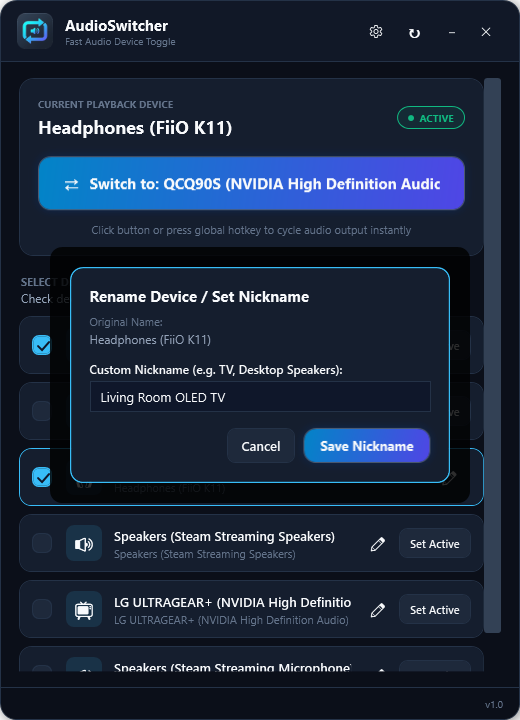

# AudioSwitcher User Guide

Welcome to the **AudioSwitcher** user guide. This document covers everything you need to know to set up, customize, and get the most out of AudioSwitcher.

---

## Table of Contents
1. [Quick Start](#quick-start)
2. [Main Interface Overview](#main-interface-overview)
3. [Switching Audio Devices](#switching-audio-devices)
   - [One-Click Toggle Button](#1-one-click-toggle-button)
   - [Global Hotkey (`Ctrl + Alt + A`)](#2-global-hotkey-ctrl--alt--a)
   - [System Tray Instant Switch](#3-system-tray-instant-switch)
   - [Direct Selection](#4-direct-selection)
4. [Customizing Device Rotation](#customizing-device-rotation)
5. [Renaming Devices & Nicknames](#renaming-devices--nicknames)
6. [Application Settings](#application-settings)
7. [System Tray & Windows Startup](#system-tray--windows-startup)
8. [Frequently Asked Questions & Troubleshooting](#frequently-asked-questions--troubleshooting)

---

## Quick Start

1. **Download & Run**:
   - Download the latest standalone `AudioSwitcher.exe` or `AudioSwitcher-win-x64.zip` from [GitHub Releases](https://github.com/esquillaxsoft-cloud/audio-switcher/releases/latest).
   - Place it in a folder of your choice (e.g., `C:\Tools\AudioSwitcher\`).
   - Double-click `AudioSwitcher.exe` to run. No installation or administrative privileges required.
2. **Select your primary devices**: Check the boxes next to the audio endpoints you want to switch between (e.g. your Headphones and your TV).
3. **Press the button or hit `Ctrl + Alt + A`**: Audio output changes immediately across Windows!

---

## Main Interface Overview


The main window is organized into clear sections:
* **Header Bar**: Displays the application icon, title, settings button (⚙️), manual device refresh (🔄), minimize, and close controls. You can click and drag anywhere on the header to move the window.
* **Current Playback Device Card**: Shows the currently active default Windows multimedia device with a green `● ACTIVE` badge.
* **Hero Action Button**: Shows the target device you will toggle to upon clicking.
* **Device Rotation List**: Lists all active audio output devices detected on your system, each with its endpoint type icon (Speakers, Headphones, TV/Display, or Digital Output).

---

## Switching Audio Devices

AudioSwitcher provides four convenient ways to switch your audio output:

### 1. One-Click Toggle Button
Click the large glowing **Switch to: [Device]** button in the main window. Audio immediately redirects to the next selected device in your rotation.

### 2. Global Hotkey (`Ctrl + Alt + A`)
Press <kbd>Ctrl</kbd> + <kbd>Alt</kbd> + <kbd>A</kbd> from anywhere—even inside full-screen games, video players, or IDEs. You do not need to alt-tab or minimize what you are doing.

### 3. System Tray Instant Switch
* **Left-Click** the AudioSwitcher tray icon in the Windows taskbar corner to immediately switch to the next device.
* **Hover** over the tray icon to see the active audio endpoint in the tooltip.
* **Right-Click** the tray icon for a quick-access menu with your full device list, quick toggle, settings, and exit.

### 4. Direct Selection
Click the **Set Active** button next to any device in the list to switch to it directly, regardless of whether it is in the toggle rotation.

---

## Customizing Device Rotation

Not every connected device needs to be in your toggle cycle. 

1. Find the device in the **Select Devices for Toggle Cycle** list.
2. Toggle the checkbox on the left:
   * **Checked**: The device participates in the fast toggle cycle and global hotkey rotation.
   * **Unchecked**: The device is skipped during fast switching, but remains available for direct selection.

The order badge (e.g. `#1`, `#2`) indicates the position of the device within your toggle rotation.

---

## Renaming Devices & Nicknames

Windows often assigns cryptic names to audio endpoints (such as `QCQ90S (NVIDIA High Definition Audio)` or `Realtek USB Audio`). AudioSwitcher lets you assign clear, human-friendly nicknames.



1. Click the **Pencil (Edit)** icon next to any device in the list.
2. In the popup dialog, enter your custom nickname (e.g., `Living Room OLED TV` or `Desktop Speakers`).
3. Click **Save Nickname** (or press <kbd>Enter</kbd>).
4. The nickname will now be used throughout the app, in the system tray menu, tooltip, and the OSD banner.
5. To revert back to the original Windows name, open the dialog, clear the text field, and click Save.

---

## Application Settings

Click the **Gear icon (⚙️)** in the top-right header to open the Settings panel.


### Global Shortcut
* **Enable Global Keyboard Shortcut to Switch**: Enable or disable the system-wide hotkey.
* **Current Shortcut**: Click the shortcut button to record a new key combination of your choice.

### Behavior & Notifications
* **Show On-Screen Floating Banner (OSD) on Switch**: Displays a sleek, non-intrusive floating banner in the bottom-right corner whenever audio switches, showing the newly activated device.
* **Start AudioSwitcher with Windows (Minimized)**: Automatically adds AudioSwitcher to the Windows startup registry (`HKEY_CURRENT_USER\Software\Microsoft\Windows\CurrentVersion\Run`). On boot, it starts silently minimized to your system tray.
* **Minimize window to System Tray**: When clicking the minimize button (`-`), hides the window completely to the tray instead of cluttering your taskbar.
* **Closing window minimizes to System Tray**: When clicking the close button (`✕`), keeps AudioSwitcher running quietly in the background tray. To completely exit, right-click the tray icon and select **Exit AudioSwitcher**.
* **Switch Default Communications Device along with Multimedia**: When enabled, switching audio will set both the default playback device (music, games, media) and the default communications device (Discord, Teams, Zoom).

Click **Save Settings** to persist your changes to disk.

---

## System Tray & Windows Startup

AudioSwitcher is designed to live quietly in your system tray:

* **Tray Left-Click**: Cycles through your configured devices instantly without bringing up any windows.
* **Tray Hover Tooltip**: Displays the current audio device:
  ```text
  AudioSwitcher
  Active: Living Room OLED TV
  ```
* **Tray Right-Click Menu**:
  * Displays all connected playback devices with a checkmark on the active device. Click any device to switch to it immediately.
  * **Switch Audio Output**: Quick toggle.
  * **Open AudioSwitcher**: Restores the main window.
  * **Settings**: Opens directly to settings.
  * **Exit AudioSwitcher**: Shuts down the background process and releases global hotkeys.

---

## Frequently Asked Questions & Troubleshooting

### Why did a device disappear after unplugging?
AudioSwitcher listens directly to Windows WASAPI CoreAudio hardware events. When a USB headset, DAC, or HDMI cable is unplugged, Windows removes the endpoint and AudioSwitcher immediately updates its list. When plugged back in, AudioSwitcher restores it (along with any custom nickname you assigned). You can also click the **Refresh button (🔄)** in the header at any time.

### Does "Start with Windows" need administrator permissions?
No! AudioSwitcher writes to your user-level startup registry (`HKCU`), so it never triggers a UAC administrator prompt on boot. Just remember to keep the `.exe` in a permanent folder.

### Does the hotkey work in full-screen games?
Yes. The hotkey uses the native Windows Win32 API (`RegisterHotKey`), which intercepts keystrokes system-wide at the OS level before applications capture them.
