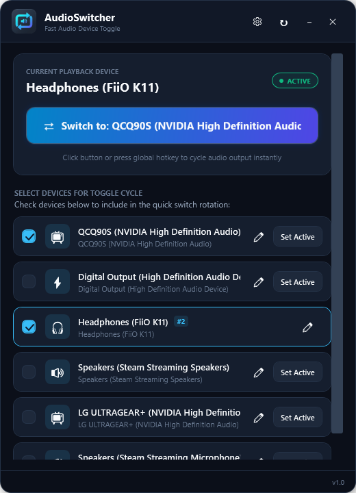
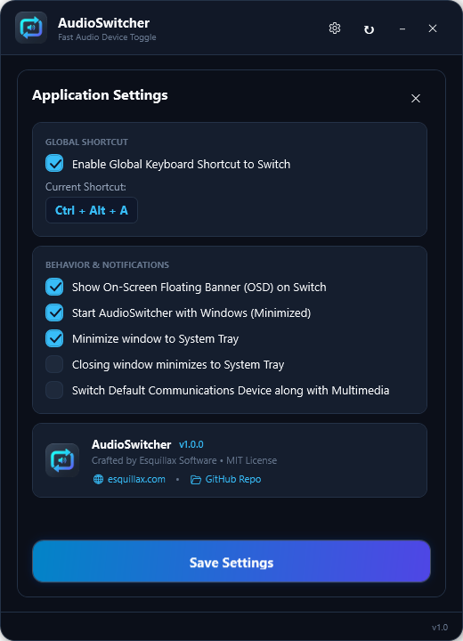

# AudioSwitcher

A fast, lightweight Windows desktop application (.NET 9 / WPF) designed to eliminate the hassle of switching between audio playback devices (e.g. TV and desktop speakers).

## 📥 Download

Grab the latest standalone release from the [GitHub Releases](https://github.com/esquillaxsoft-cloud/audio-switcher/releases/latest) page:

- **`AudioSwitcher-v1.0.0-win-x64.zip`**: Portable zip archive (extract and run anywhere).
- **`AudioSwitcher.exe`**: Direct standalone single-file executable (no installer needed).

*Runs on 64-bit Windows 10 / 11.*

> 📖 **Need help getting started?** Check out the complete [**User Guide**](docs/USER_GUIDE.md) for detailed instructions on setting up device rotations, custom nicknames, hotkeys, and tray features.

---

## 📸 Screenshots

<p align="center">
  
  &nbsp;&nbsp;&nbsp;&nbsp;
  
</p>

---

## ✨ Features

- **One-Click Quick Toggle**: Prominent primary button that cycles immediately between your configured devices.
- **Configurable Device Rotation**: Checkbox list of active audio endpoints to include or exclude from the rotation.
- **Custom Nicknames**: Rename cryptic endpoint names (e.g. `QCQ90S` ➔ `OLED TV`) with inline editing.
- **System Tray Integration**:
  - **Left-click tray icon**: Instantly cycles to the next configured device without opening windows.
  - **Right-click tray icon**: Context menu with direct device list (with checkmarks), instant toggle, settings, and exit.
  - Dynamic tray tooltip reflecting the active audio device in real-time.
- **Global Shortcut**: Press `Ctrl + Alt + A` from any full-screen game, video, or app to switch audio output without losing focus.
- **Floating OSD Banner**: Sleek, non-activating on-screen display banner overlay that briefly indicates the newly activated device.
- **Real-Time Endpoint Tracking**: Uses Windows CoreAudio WASAPI notifications to immediately react when devices are plugged in, unplugged, or changed by Windows.
- **Windows Startup & Minimize-to-Tray**: Optional auto-run on Windows boot and close/minimize to tray.

---

## 🛠 Tech Stack

- **Platform**: Windows 10 / Windows 11 (x64)
- **Framework**: .NET 9.0 (WPF + WinForms Tray Interop)
- **Audio Core**: Windows CoreAudio COM Interop (`IPolicyConfig` + `IMMDeviceEnumerator` via `NAudio.Wasapi`)
- **Settings**: JSON persistence in `%APPDATA%\Esquillax\AudioSwitcher\settings.json`

---

## 🚀 Getting Started

### Prerequisites
- [.NET 9.0 SDK](https://dotnet.microsoft.com/download/dotnet/9.0) or later

### Building & Running
Clone the repository and run:

```powershell
# Restore & Build
dotnet build AudioSwitcher.sln -c Release

# Run
dotnet run --project AudioSwitcher.csproj
```

The compiled standalone executable is generated in:
```
bin\Release\net9.0-windows\AudioSwitcher.exe
```

---

## ⚙️ Configuration

Settings are saved in `%APPDATA%\Esquillax\AudioSwitcher\settings.json`:
- `SelectedDeviceIds`: Array of audio endpoint IDs participating in the toggle rotation.
- `DeviceAliases`: Key-value mapping of device IDs to custom friendly names.
- `EnableHotkey`: Global shortcut enable/disable (`Ctrl + Alt + A`).
- `ShowOsd`: Floating banner overlay enable/disable.
- `StartWithWindows`: Auto-start with Windows via Registry.
- `MinimizeToTray` / `CloseToTray`: Background tray behavior.

---

## 📄 License

This project is open-source and licensed under the [MIT License](LICENSE).  
Copyright © 2025-2026 Esquillax Software. All rights reserved.
